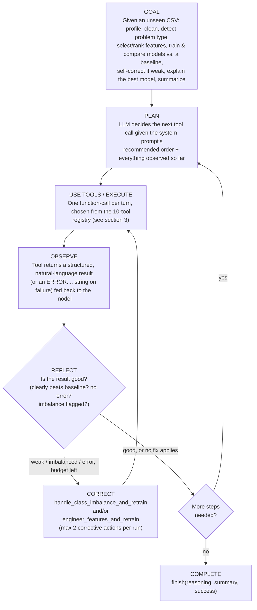

# DataSage — Agent Architecture

### Track A: Autonomous ML Pipeline & Auto-EDA Agent

This document is the architecture-diagram deliverable: system components, the agent's tool set, and the **GOAL → PLAN → USE TOOLS → EXECUTE → OBSERVE → REFLECT → CORRECT → COMPLETE** loop the agent actually runs. All diagrams are Mermaid and render directly on GitHub.

---

## 1. System overview

```mermaid
flowchart LR
    User["User"] -->|upload CSV| Frontend["Frontend\n(frontend/index.html)"]
    Frontend -->|REST API\n/api/results, /api/trace| Backend["FastAPI Backend\n(app/main.py)"]
    Backend -->|run_pipeline_task| Orchestrator["Agent Orchestrator\n(app/agent/orchestrator.py)"]

    Orchestrator -->|LLM call (auto at runtime / fallback on fail)| LLMAgent["LLM Agent Loop\n(app/agent/llm_agent.py)"]
    Orchestrator -.->|no key / offline demo mode| FallbackAgent["Deterministic Fallback\n(app/agent/fallback_agent.py)"]

    LLMAgent -->|function-calling\nOpenAI-compatible| LLMProvider[("Ollama (local) / Groq /\nGemini / OpenAI\nwhichever is configured")]

    LLMAgent -->|calls tools| ToolLayer["Tool Layer\n(app/agent/tools.py)"]
    FallbackAgent -->|calls fixed order| ToolLayer

    ToolLayer -->|executes modules| PipelineModules["Pipeline Engine Modules\n(profiler, cleaner, trainer,\nevaluator, explainer)"]

    ToolLayer -->|saves results| Storage[("Storage (storage/)\nresults.json, metrics, plots,\npreprocessed CSV")]

    Backend -.->|reads| Storage
    Backend -.->|streams| TraceUI["Agent Trace UI\nevery\nGOAL / PLAN / ACT / OBS / REFLECT / CORRECT\nstep"]
    TraceUI -.-> Frontend
```

---

## 2. The agent loop (what actually runs per request)



---

## 3. Tool registry (`app/agent/tools.py`)

| # | Tool | Type | What it does |
|---|---|---|---|
| 1 | `profile_data` | **core** | Load CSV, report shape/dtypes/missing/duplicates, suggest a target column |
| 2 | `clean_data` | **core** | Drop empty columns + exact duplicate rows |
| 3 | `detect_problem_type` | **core** | Classification / regression / clustering, with the reason |
| 4 | `select_and_rank_features` | **core** | Drop unusable (ID-like) columns, rank feature importance, build EDA charts, export cleaned CSV |
| 5 | `train_and_evaluate_models` | **core** | Train every candidate model + a naive baseline, score, pick the best |
| 6 | `handle_class_imbalance_and_retrain` | **corrective** | Oversample minority class(es), retrain — only invoked when the agent decides imbalance is hurting the result |
| 7 | `engineer_features_and_retrain` | **corrective** | Drop low-importance features and/or add an interaction feature, retrain — only invoked when the agent decides the model is too weak |
| 8 | `explain_best_model` | **core** | SHAP (tree/linear models) or permutation importance fallback |
| 9 | `generate_insights` | **core** | Plain-English summary from the structured results (LLM or template) |
| 10 | `finish` | **control** | Ends the loop with a reasoned summary + success flag |

> **Reasoning & Trace Observability**: Every tool call requires a `reasoning` argument — the model's own stated justification for taking that action right now, given what it has seen. That reasoning, plus each tool's observation, is what's rendered verbatim in the frontend's **Agent Trace** tab, and what's returned by `GET /api/trace/{run_id}`.

---

## 4. Error recovery, concretely

Before this rework, an unmodelable dataset (e.g. every column is an ID or free text) raised an uncaught `ValueError` and the whole run died with a generic `500`. Now:

- `select_and_rank_features` raises a `ToolError` instead.
- The agent sees it as an observation, reflects on it in the trace, and calls `finish(success=false, ...)` with a specific, human-readable explanation.
- The run completes gracefully and the user sees exactly why, in the same **Agent Trace UI** as a successful run.

---

## 5. Tech stack

- **Backend**: FastAPI + Uvicorn (`app/main.py`)
- **Agent / Orchestration**: Hand-rolled function-calling loop against the OpenAI API (`app/agent/llm_agent.py`) — chosen over a heavier framework (LangGraph/CrewAI) so the full `GOAL → ... → COMPLETE` loop, tool schemas, and trace format are all visible in ~250 lines instead of framework abstractions, which matters for a judged demo.
- **ML Engine**: `scikit-learn`, `XGBoost` (optional), `SHAP` (with automatic permutation-importance fallback).
- **LLM**: Any OpenAI-compatible function-calling API — **Ollama** (local, free, no account), **Groq** (`llama-3.3-70b-versatile`, free) or **Gemini** (free), **OpenAI** (`gpt-4o-mini`, paid) also supported. Provider is auto-selected from whichever is configured (`app/config.py:resolve_llm_provider`); an unreachable/failing provider falls back to the deterministic mode at runtime rather than crashing the run.
- **Frontend**: Single-page vanilla JS + Plotly (`frontend/index.html`), now including an **Agent Trace** tab.
- **Storage**: Local filesystem (`storage/`) — no DB in this v1, matching the original project's documented scope.
